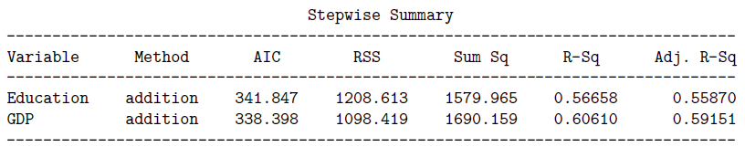
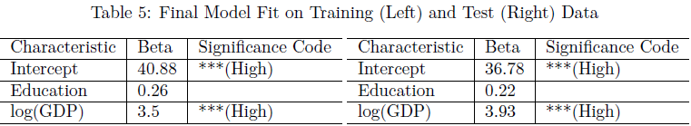

# The Impact of Health-Adjacent Lifestyle Factors in Global Health

  

In the study of global health, the measure of life expectancy is one of the most important indicators of the overall health and wellness of the world. In such research, it is important to identify potential factors thatcould contribute to greater longevity. To this end, this report will analyze the extent to which socioeconomic factors such as development status, GDP, population, alcohol consumption, and education have an effect on life expectancy to hopefully elucidate a relationship that can be used to identify methods to prolong life expectancy around the world.

[An article published in the J-Stage Journal of Epidemiology](https://www.jstage.jst.go.jp/article/jea/24/2/24_JE20130059/_article) considered mean years of schooling and gross national income per capita for 91 countries as potential contributors to life expectancy. The results suggested that these factors were correlated to life expectancy, and thus education should be improved in order to increase the overall duration of life. Our analysis will similarly examine potential socioeconomic factors to life expectancy, using data reported in 2019.

## Methods
The goal of this analysis is to develop a model that can explain the relationship between life expectancy
and several socioeconomic factors. This process will involve a series of statistical methods regarding variable
selection, model validation, and assessing potential violations through model diagnostics.

## Variable Selection

In order to select the best set of variables to use in the regression model, we will compare the results of three
different variable selection methods.

1. Forward Selection
This method begins with a model of zero predictors, and builds the model by adding one predictor at a
time in such a way that minimizes the AIC. This continues until the AIC increases, or there are no more
predictors left to add.

2. Backwards Elimination
Similar to the first method but in reverse order, this method begins with a model of all possible predictors,
and removes one predictor at a time whilst trying to minimize the AIC. This continues until the AIC
increases, or there are no more predictors left to remove.

3. Stepwise Selection
This process alternates between forward and backwards selection methods until there are no more variables
to add or delete, or the AIC increases.
From these results, we will select a model that both performs well while still making sense contextually.

## Model Validation

It is important for the model we build to be able to make meaningful predictions on independent data. In
order to validate our model, we will randomly divide our data into two smaller datasets (in 50/50 proportion):

1. A Training Dataset
This dataset will be used to build our model and perform any kind of model-building diagnostics.

2. A Test Dataset
Once the model is built on the training dataset, the test dataset will be used to evaluate the performance of
the model.

In order for the model to be validated, we must not be able to observe significant differences in the estimated
regression coefficients, significant predictors, model violations, and adjusted R-squared between the model
fit on the training dataset versus the test dataset.

## Potential Model Violations and Precautionary Diagnostics

In order to properly interpret the result of our linear regression model, we must ensure that the four assumptions
of linear regression have first been satisfied. We will evaluate each assumption through the use of
residual plots, given that two conditions are met:

**Condition 1: The conditional mean response is a single function of a linear combination of the
predictors.**

This condition is satisfied if the fitted values are randomly distributed around the identity function

**Condition 2. The conditional mean of each predictor is a linear function with another predictor.**

Using pairwise plots between the numerical predictors, if there are no distinct curved, periodic, or anything
other than a linear or random pattern, this condition is satisfied.
Once we verify that these two conditions are met, we will use residual plots to evaluate the assumptions of
linear regression.

**Assumption 1: Linearity of the Relationship**

We must not be able to observe any pattern beyond a linear relationship in the residual plots. If there are
no non-linear trends visible, we can conclude that there exists a linear relationship between the predictors
and the response.

**Assumption 2: Uncorrelated Errors**

The residuals should be randomly scattered, with no odd or separated clusters of residuals in the plots.

**Assumption 3: Common Error Variance (Homoscedasticity)**

The residuals must remain relatively equally spread out for any value of the predictors.

**Assumption 4: Normality of Errors**

A Normal QQ plot can be used to assess this assumption. If the residuals in the QQ plot lie along the
diagonal line, we can conclude that they are Normally distributed.
If any of these four assumptions are not satisfied, the model will not be as effective as we need to properly
explain the relationship between the predictors and the response.

## Data Introduction and Description

The data used in this analysis has primarily been gathered from the WHO and World Bank’s data libraries,
and is compiled into one dataframe. All data is reported for the year 2019.

### Response: Life Expectancy
[Life expectancy data was gathered from the WHO](https://www.who.int/data/gho/data/indicators/indicator-details/GHO/life-expectancy-at-birth-(years)), and reports life expectancy at birth for both sexes for each WHO member state.

### Predictor 1: Population
[Population data was gathered from the World Bank](https://data.worldbank.org/indicator/SP.POP.TOTL?end=2020&start=2018), and reports the total population of each UN member state.

### Predictor 2: Alcohol Consumption
[Alcohol consumption data was gathered from the WHO](https://www.who.int/data/gho/data/themes/topics/topic-details/GHO/levels-of-consumption), and reports levels of total alcohol consumption reported per capita for each WHO member state.

### Predictor 3: GDP
[GDP data was gathered from the World Bank](https://data.worldbank.org/indicator/NY.GDP.PCAP.CD), and reports countries’ GDP per capita in current US dollars.

### Predictor 4: Education
Education is measured in mean years of schooling of a country’s population aged 25 years or older. [This data was gathered from the World Bank.](https://tcdata360.worldbank.org/indicators/h22a4bb2b?country=BRA&indicator=41393&viz=line_chart&years=2017,2019)

### Predictor 5: Development Status
Development status data was retrieved from a 2018 open-source dataset titled [“Life Expectancy (WHO)”](https://www.kaggle.com/datasets/kumarajarshi/life-expectancy-who), which is a collection of data supplied by the WHO and United Nations.

## Numerical and Visual Summaries

  

The skews observable in these histograms are due to disparities in these socioeconomic factors around
the world. These distributions in themselves should cause no issues for our analysis, however; it is the
distributions of the residuals we will be concerned with in further sections.

## Creating the Training and Test Datasets
Below are the summary statistics for the training and test datasets:

  

While there are slight differences in some measures, we can safely move forward knowing that the training
and test data are relatively similar.

# Building the Model
We will begin the process of building the model by first examining the full model with all predictors.

  

The p-values of Developing Status, Population, and Alcohol Consumption appear to be quite high; this
could suggest that excluding these less significant variables could improve our model. We will see if we can
determine a better model by minimizing the AIC.

### Forward Selection

  

### Backwards Elimination

  

### Stepwise Selection

  

Each of these summaries suggest that Education and GDP should be the only predictors included in the
model. Since the p-values for the omitted predictors are large, we conclude that they do little to explain
changes in life expectancy. The contextual interpretation of this result is also reasonable, as it suggests
that education and GDP are perhaps the most significant of these factors that contribute to life expectancy.
Below is the summary of the proposed final model:

  

And the equation of the proposed final model is as follows:

  

## Model Violations and Diagnostics
As explained in the Methods section, we must first check that the two conditions are satisfied before conducting
residual plot analysis.

  

The fitted values are randomly scattered around the identity function, so we conclude that Condition 1
is satisfied. A problem arises when examining the plot between the predictors; there appears to be an
exponential relationship which would result in Condition 2 being violated. In order for this model to meet
this condition, we will perform a log transformation on the GDP predictor.

Below is the repeated diagnosis of these two conditions with the transformed predictor:

  

The plots show that the transformation allows Condition 2 to be satisfied. Condition 1 also remains satisfied.

### Residual Plot Analysis
Here we conduct a residual plot analysis as detailed in the Methods section.

  

The residuals do not show any distinct trends or relationships and appear to be relatively spaced out, which
is sufficient to conclude that the first three assumptions of linear regression are satisfied.

In order to evaluate the Normality assumption, we examine the Normal QQ plot:

  

The plot shows that the residuals are relatively but not perfectly Normally distributed, with left skew
exhibited by the deviation of the lower tail. However, we will proceed hoping that Normality will hold better
in an independent dataset as most points lie on the QQ line, noting this as a potential limitation.

The final model for our analysis is as follows:

  

## Goodness of the Final Model
As explained in the Methods section, the model is validated if there are no stark differences between its
performance on the test data versus its performance on the training data.

### Model Characteristics Fit to Test Data
Below is a comparison of the model characteristics when fit to the test data versus the training data:

  

The characteristics of the model in each dataset are similar enough to say that its performance would be
the same in an independent dataset. Additionally, the adjusted R-squared for the model fit on the training
data is 0.6651, and on the test data is 0.7313; there is a slight difference but we believe that it is not large
enough to cause concern.

### Model Violations and Diagnostics in Test Data
The last step in our verification process is to assess whether model assumptions have changed by repeating
our model diagnostics process using the test data.

  

As is the case for the training data, these plots suggest that the model fitted to the test data also satisfies
Conditions 1 and 2.

Now we can proceed with residual plot analysis on the test data.

  

The residual plots appear randomly scattered, which indicates that the first three assumptions of linear
regression (Linearity, Uncorrelated Errors, Homoscedasticity) are satisfied.

Again, to assess the Normality assumption we use a Normal QQ plot:

  

This QQ plot better satisfies the Normality assumption. This suggests that the skew seen in the training
data could have simply been a result of random variation. We can now say with confidence that the model
meets all assumptions, and therefore the model is sufficiently validated.

# Results and Discussion

## Final Model Interpretation and Importance
The equation for our final regression model is as follows:

  

Each of the terms in the regression model have meaningful interpretations that can lead us to a useful
conclusion for our analysis.

**Intercept:** The average lifespan in a country with zero education or GDP is 40.88 years.

**Education:** For each additional year of education completed on average, the mean life expectancy of a
country will increase by 0.26 years for both genders. This is a significant result, as a quarter-year of
additional life per year of schooling suggests that education is a key factor to longevity.

**log(GDP):** Since a log-transformation was performed, [we interpret this result differently](https://data.library.virginia.edu/interpreting-log-transformations-in-a-linear-model/). Our interpretation is that for a 1% increase in GDP per capita of a country, the average life expectancy for both genders will increase by 0.035 (3.5/100) years. While this increase seems like a small number, it is important to understand that GDP per capita is a metric whose values vary wildly (see Numerical and Visual Summaries), and so the gains in life expectancy caused by a growth in GDP is more significant than this number suggests.

# Conclusion
Education and GDP were defined in this report as being significant contributors to life expectancy, however
it is not as easy to simply increase a country’s GDP than it is to expand education. Therefore, this report
concludes that the expansion of education is perhaps the most important socioeconomic change that can
prolong life. Additionally, we determined that Population, Alcohol Consumption, and Development Status
were not significantly related to life expectancy.

## Model Limitations
There were two primary limitations in this analysis that could have affected the efficacy of the model, or our
conclusions.

**1. Without transformation, the data would not have been suitable for linear regression.**
A transformation was conducted on the GDP variable in the Model Diagnostics section, as the assumptions
for linear regression would have been violated otherwise. This suggests that the data in its original state might
not have been appropriate for use in regression, and we also had to interpret the result of the transformed
variable differently.

**2. The model fitted to training data struggled to satisfy the Normality assumption.**
Initially it seemed the model struggled to meet the Normality assumption, however this concern was mostly
resolved upon fitting the model to our test data.

# References

Costa de Souza, F. (2018). Life expectancy and healthy life expectancy changes between 2000 and 2015: an
analysis of 183 World Health Organization member states. Journal of Public Health, 26, 261-269.

Mondal, Md. and Shitan, M. (2014). Relative Importance of Demographic, Socioeconomic and Health
Factors on Life Expectancy in Low- and Lower-Middle-Income Countries. J-Stage Journal of Epidemiology,
Volume 24 Issue 2. 117-124.

WHO. (2019). Life expectancy at birth (years). The Global Health Observatory.

The World Bank. (2020). Population, total.

WHO. (2019). Levels of Consumption. The Global Health Observatory.

The World Bank. (2020). GDP per capita (current US$).

The World Bank. (2019). GCI 4.0: Mean years of schooling. TCdata360.

Rajarshi, K. (2018). Life Expectancy (WHO). Kaggle.
